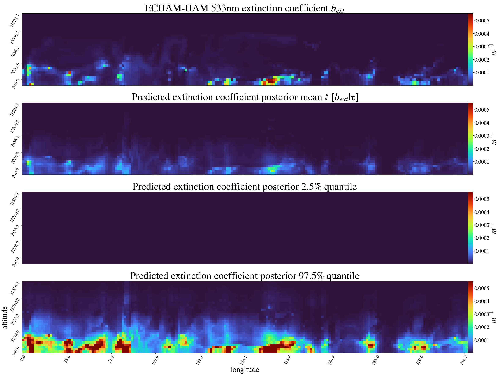

# AODisaggregation: toward global aerosol vertical profiles

## Getting started

Download curated dataset to run experiments [here](https://www.dropbox.com/s/m5p9ztdkqyfvud3/aodisaggregation_emmisions_test_6.3_ACCMIP_200806.06_echam.nc?dl=0).

Run from root directory

- Stochastic variational Gaussian process model to reconstruct extinction profiles
```bash
$ python run_svgp_vertical_profile.py --cfg=cfg/svgp.yaml --o=path/to/output/directory --plot
```

- Exponential idealized baseline to reconstruct extinction profiles
```bash
$ python run_idea_vertical_profile.py --cfg=cfg/ideal.yaml --o=path/to/output/directory --plot
```


<p align="center">
  
</p>
<p align="center">
  <em> Example of vertical slices at latitude 51.29 of groundtruth ECHAM-HAM extinction profiles, predicted extinction posterior mean and 2.5%/97.5% quantiles of predicted extinction distribution </em>
</p>


## Reproduce experiments

- SVGP
Run the bash script to repeat the experiment with multiple seeds
```bash
$ bash repro/repro_svgp.sh --device=cpu
```

Aggregate results across seeds to recover results from the paper
```bash
$ python aggregate_results.py --i=experiments/data/outputs/svgp --o=experiments/data/outputs/svgp
```


## Installation

Code implemented in Python 3.8.0

#### Setting up environment with [`pyenv`](https://github.com/pyenv/pyenv)

Create and activate environment
```bash
$ pyenv virtualenv 3.8.0 venv
$ pyenv activate venv
$ (venv)
```

Install dependencies
```bash
$ (venv) pip install -r requirements.txt
```


## References
